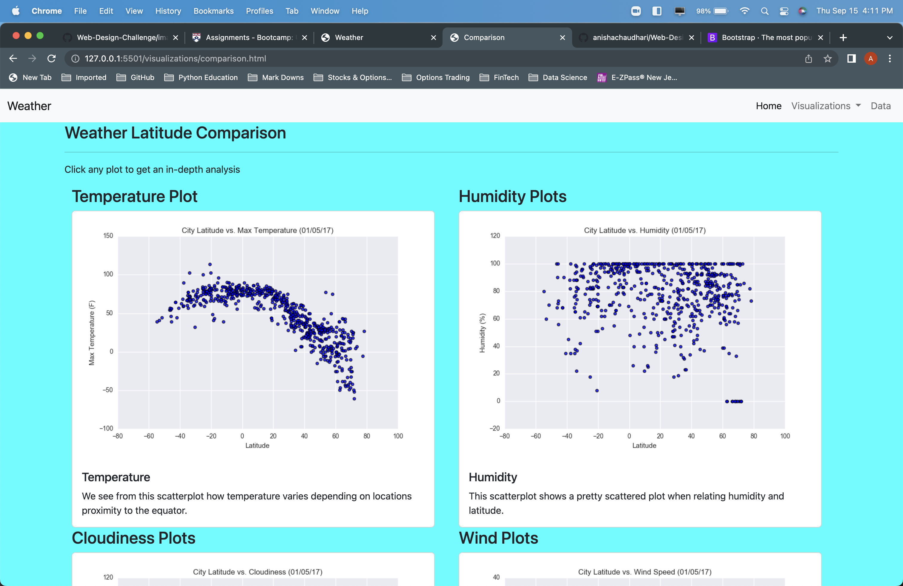

# Weather Comparison Web Development 

## Description
        - Created a website using weather data and analysis.  Obtained scatterplots using Matplotlib and described correlations between varying weather elements.
## Table of Contents
- [Installation](#installation)
- [Usage](#usage)
- [Credits](#credits)
- [Screenshots](#screenshot)
- [License](#license) -- https://opensource.org/licenses/MIT

## Installation
        - No installation instructions necessary.
## Usage
        -  Open webpage in browser of your choice URL -- github.website
## Screenshot

    - Landing Page

    - Comparison Page Large

    - Comparison Page Small

    - Data Page

    -Temperature Page

    -Humidity Page

    -Cloudiness Page

    -Wind Page

## Credits

## License
  Copyright 2022 Anisha Chaudhari

        Permission is hereby granted, free of charge, to any person obtaining a copy of this software and associated documentation files (the "Software"), to deal in the Software without restriction, including without limitation the rights to use, copy, modify, merge, publish, distribute, sublicense, and/or sell copies of the Software, and to permit persons to whom the Software is furnished to do so, subject to the following conditions:
        
        The above copyright notice and this permission notice shall be included in all copies or substantial portions of the Software.
        
        THE SOFTWARE IS PROVIDED "AS IS", WITHOUT WARRANTY OF ANY KIND, EXPRESS OR IMPLIED, INCLUDING BUT NOT LIMITED TO THE WARRANTIES OF MERCHANTABILITY, FITNESS FOR A PARTICULAR PURPOSE AND NONINFRINGEMENT. IN NO EVENT SHALL THE AUTHORS OR COPYRIGHT HOLDERS BE LIABLE FOR ANY CLAIM, DAMAGES OR OTHER LIABILITY, WHETHER IN AN ACTION OF CONTRACT, TORT OR OTHERWISE, ARISING FROM, OUT OF OR IN CONNECTION WITH THE SOFTWARE OR THE USE OR OTHER DEALINGS IN THE SOFTWARE.
## Badges
 
## Features

## How to Contribute
        - Not applicable.
## Tests
        - Manual testing done at milestones utilizing Live Server extension
## Questions
    - Please direct questions to anishaamin14@hotmail.com    
    - GitHub  https://www.github.com/anishachaudhari 